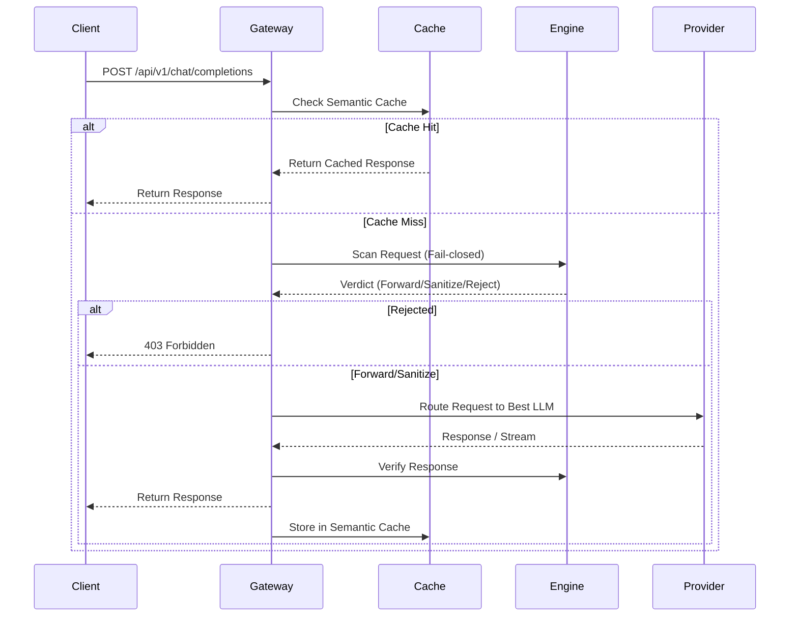

# Aegis -- Zero-Trust Responsible AI Gateway

Team Future Bytes. An inspection and governance layer that sits between an
organisation and the LLM providers it uses, built against the seven EU HLEG
requirements for Trustworthy AI. The design and the division of work are in
[`docs/AEGIS_PROBLEM_STATEMENT.md`](docs/AEGIS_PROBLEM_STATEMENT.md).

| Part | Owner | Where |
|---|---|---|
| **Inspector** -- FastAPI service: secret / PII / injection detection, redaction, policy engine, audit database, human review, fairness harness, embeddings, grounded response verification, egress screens | Person 1 | [`backend/`](backend/README.md) |
| **Gateway + dashboard** -- Next.js: OpenAI-compatible `/api/v1/chat/completions`, provider routing + failover, semantic cache (Redis Stack), streaming, dashboard | Person 2 | [`frontend/`](frontend/), [`lib/`](lib/), [`config/`](config/) -- see [`docs/FRONTEND.md`](docs/FRONTEND.md) |
| Build plan and debt ledger | Person 1 | [`docs/PERSON1_BUILD_PLAN.md`](docs/PERSON1_BUILD_PLAN.md) |
| **CLI** -- `aegis scan` pre-commit/CI credential scanning, `aegis chat` guarded chat through the Gateway with the pipeline readout, `appeal`/`reviews`, `status` | Person 1 | [`cli/`](cli/README.md) -- `pip install -e ./cli` |
| **Browser extension** -- intercepts sends on ChatGPT/Claude/Gemini, scans via the Inspector, blocks or sanitises before the site sees it; injection screen on paste; info popup | Person 2 | `extension/` -- plan in [`docs/EXTENSION_CLI_PLAN.md`](docs/EXTENSION_CLI_PLAN.md) |
| Pitch deck | -- | [`presentation/`](presentation/) |

## Run it

```bash
cp backend/.env.example .env      # set AEGIS_USER_HASH_SALT, AEGIS_ADMIN_TOKEN, AEGIS_REVIEWER_TOKEN
docker compose up --build         # gateway :3000, inspector :8000, redis-stack, postgres
```

Without Docker: the inspector quick start is in [`backend/README.md`](backend/README.md);
the gateway is `cd frontend && npm install && npm run dev` with `AEGIS_ENGINE_URL=http://localhost:8000`.
Interactive API docs at <http://localhost:8000/docs>; the contract is
[`backend/openapi.json`](backend/openapi.json).

## What it claims and what it does not

Detection is heuristic and says so in every response. Cost and carbon
figures are estimates and carry their basis. Grounded Response Verification
is a support score, not a truth oracle. The fairness harness reports what it
measures, including the gap it has not closed (PERSON recall for East Asian
and African names is lower than for other groups). The audit trail is
transaction evidence, not a conformity assessment. The full list is under
*Limitations* in the backend README.

---

# Gateway (Person 2)

## Gateway Pipeline

The Aegis gateway processes requests through a rigorous pipeline:



## Streaming

Aegis fully supports streaming responses (`stream: true`). When a request is made, the initial input is still scanned synchronously (failing closed on timeout). Once the input is approved, Aegis establishes a stream with the provider and relays tokens to the client in real-time, matching the OpenAI SSE format.

## Cache

We utilize **Redis** for semantic caching via vector embeddings. If an incoming prompt's embedding falls within a high cosine-similarity threshold of a previously cached prompt, the cached response is returned immediately. This drastically reduces LLM costs and latency for repetitive queries. Cache is bypassed for requests containing secrets or blocked content.

## Routing

Aegis dynamically routes requests based on configuration rules. It can route traffic based on model requested, user tier, or specific tags, allowing you to seamlessly balance load across different LLMs or providers without modifying client code.

## Failover

To ensure high availability, Aegis implements **Circuit Breakers** and **Failover Groups**. If a primary provider (e.g., OpenAI) experiences high latency or errors, the circuit breaker opens, and Aegis automatically reroutes requests to a fallback provider (e.g., Anthropic or local models). The circuit breaker periodically tests the primary provider to resume normal routing once healthy.

## Dashboard

The Next.js frontend provides a comprehensive dashboard to visualize traffic, monitor security detections, and track estimated costs and cache hits.

## API Usage

Aegis acts as a drop-in replacement for the OpenAI API. You can use standard SDKs by simply changing the `baseURL`.

### OpenAI Client Example

```python
from openai import OpenAI

client = OpenAI(
    api_key="aegis-not-required",
    base_url="http://localhost:3000/api/v1"
)

response = client.chat.completions.create(
    model="gpt-4o",
    messages=[
        {"role": "system", "content": "You are a helpful assistant."},
        {"role": "user", "content": "Hello, world!"}
    ],
    # Aegis custom headers can be passed via extra_headers
    extra_headers={
        "x-aegis-mode": "sanitize"
    }
)

print(response.choices[0].message.content)
```

## Security limitations (gateway)

**IMPORTANT**: Aegis detection mechanisms (including PII, secrets, and malicious payload scanning) are heuristic and rely on a combination of regular expressions, ML models, and policy engines. They are **not guaranteed** to catch 100% of all threats or sensitive data. Furthermore, Aegis **does not provide legal compliance** (e.g., HIPAA, GDPR, PCI-DSS) out of the box. You must conduct your own security reviews and ensure compliance with applicable laws when using Aegis in production.
