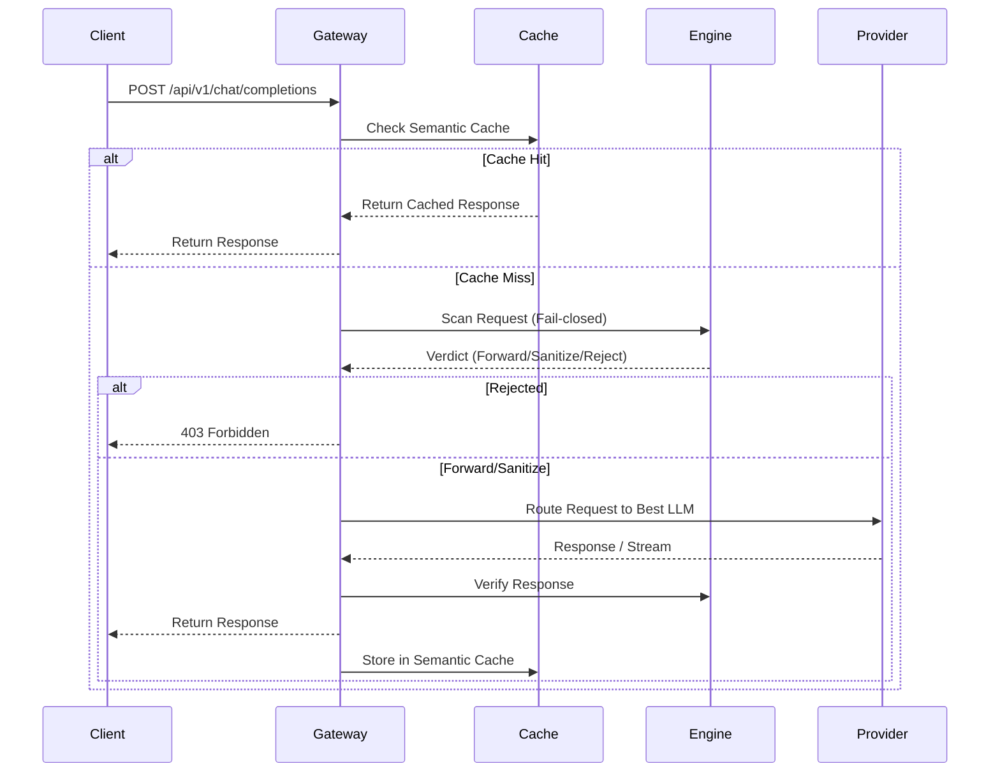

# Aegis AI

Aegis is an enterprise-grade AI security and routing gateway. It intercepts, sanitizes, and routes LLM requests through a sophisticated pipeline before forwarding them to downstream providers.

## Architecture

Aegis is composed of several key services:

- **Frontend/Gateway**: A Next.js application that provides the user-facing dashboard and acts as the OpenAI-compatible API gateway (`/api/v1/chat/completions`).
- **Python Engine**: The core security engine (currently mocked by `@aegis/mock-engine`) that handles deep payload inspection, PII detection, and policy enforcement.
- **Redis**: Used for high-speed semantic caching, rate limiting, and circuit breaker states.
- **PostgreSQL**: Persistent storage for audit logs, telemetry, and configuration.

## Gateway Pipeline

The Aegis gateway processes requests through a rigorous pipeline:



## Streaming

Aegis fully supports streaming responses (`stream: true`). When a request is made, the initial input is still scanned synchronously (failing closed on timeout). Once the input is approved, Aegis establishes a stream with the provider and relays tokens to the client in real-time, matching the OpenAI SSE format.

## Cache

We utilize **Redis** for semantic caching via vector embeddings. If an incoming prompt's embedding falls within a high cosine-similarity threshold of a previously cached prompt, the cached response is returned immediately. This drastically reduces LLM costs and latency for repetitive queries. Cache is bypassed for requests containing secrets or blocked content.

## Routing

Aegis dynamically routes requests based on configuration rules. It can route traffic based on model requested, user tier, or specific tags, allowing you to seamlessly balance load across different LLMs or providers without modifying client code.

## Failover

To ensure high availability, Aegis implements **Circuit Breakers** and **Failover Groups**. If a primary provider (e.g., OpenAI) experiences high latency or errors, the circuit breaker opens, and Aegis automatically reroutes requests to a fallback provider (e.g., Anthropic or local models). The circuit breaker periodically tests the primary provider to resume normal routing once healthy.

## Dashboard

The Next.js frontend provides a comprehensive dashboard to visualize traffic, monitor security detections, and track estimated costs and cache hits.

## Installation

To run Aegis locally without Docker, you will need Node.js 20+, Redis (with Redisearch), and PostgreSQL.

1. Clone the repository.
2. Run `npm install` in the `frontend` and `mocks/engine` directories.
3. Start the mock engine: `cd mocks/engine && npm run dev`.
4. Start the frontend: `cd frontend && npm run dev`.

## Docker Setup

The easiest way to run Aegis is via Docker Compose, which sets up the frontend, engine, Redis Stack, and Postgres.

1. Copy `.env.example` to `.env` and fill in any necessary provider API keys.
2. Run `docker compose up --build -d`
3. The gateway and dashboard will be available at `http://localhost:3000`.

## API Usage

Aegis acts as a drop-in replacement for the OpenAI API. You can use standard SDKs by simply changing the `baseURL`.

### OpenAI Client Example

```python
from openai import OpenAI

client = OpenAI(
    api_key="aegis-not-required",
    base_url="http://localhost:3000/api/v1"
)

response = client.chat.completions.create(
    model="gpt-4o",
    messages=[
        {"role": "system", "content": "You are a helpful assistant."},
        {"role": "user", "content": "Hello, world!"}
    ],
    # Aegis custom headers can be passed via extra_headers
    extra_headers={
        "x-aegis-mode": "sanitize"
    }
)

print(response.choices[0].message.content)
```

## Security Limitations

**IMPORTANT**: Aegis detection mechanisms (including PII, secrets, and malicious payload scanning) are heuristic and rely on a combination of regular expressions, ML models, and policy engines. They are **not guaranteed** to catch 100% of all threats or sensitive data. Furthermore, Aegis **does not provide legal compliance** (e.g., HIPAA, GDPR, PCI-DSS) out of the box. You must conduct your own security reviews and ensure compliance with applicable laws when using Aegis in production.
