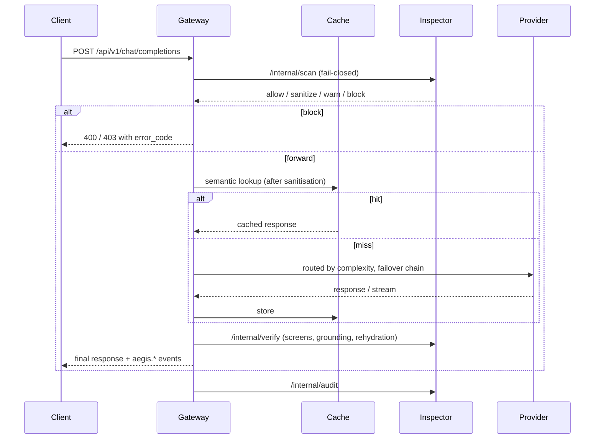

# Aegis — Zero-Trust Responsible AI Gateway

**Team Future Bytes · Ethical AI track**

Aegis sits between an organisation and the LLM providers it uses. Every
prompt is inspected before it leaves, every response is screened before it
is shown, and every decision is recorded with the rule that made it, the
policy version in force, and whether a human reviewed it. It is built
against the seven EU HLEG requirements for Trustworthy AI and it says, in
every response, what it measured and what it only estimated.

It ships in four forms that share one engine:

| Form | What it does | Where |
|---|---|---|
| **Gateway** | OpenAI-compatible `/api/v1/chat/completions`: scan → route → failover → semantic cache → verify → audit. Dashboard for traffic, threats, cost, reviews. | [`frontend/`](frontend/), [`lib/`](lib/), [`config/`](config/) · [docs](docs/FRONTEND.md) |
| **Inspector** | The engine: secret / PII / injection detection, redaction, policy engine, audit database, human review, fairness harness, embeddings, grounded response verification, egress screens. Stateless, config-as-data. | [`backend/`](backend/README.md) |
| **CLI** | `aegis scan` stops a credential before it is *committed* (pre-commit hook, CI, SARIF). `aegis chat` runs a guarded conversation through the Gateway with the live pipeline readout. `appeal` / `reviews` / `status`. | [`cli/`](cli/README.md) |
| **Browser extension** | Intercepts what you type into ChatGPT, Claude and Gemini: credentials blocked, personal data masked, pasted prompt-injection held — before the site sees it. Popup shows your deployment's numbers. | [`extension/`](extension/README.md) |

## The seven requirements, and where each lives

| HLEG requirement | Aegis feature | Proof |
|---|---|---|
| 1 Human agency & oversight | Appeals, review queue, single-use override tokens | `aegis appeal` → `aegis reviews decide`; dashboard Reviews |
| 2 Technical robustness & safety | Heuristic prompt-injection defence (27 rules, 6 OWASP LLM01 categories), egress harm screen, provider failover + circuit breakers | `aegis chat "Ignore all previous instructions…"` → 403 |
| 3 Privacy & data governance | Secret + PII detection, placeholder redaction, vault that never rehydrates secrets, hashed user refs, retention purge, subject erasure | `aegis chat` with an email → `[EMAIL_1]` sent, rehydrated in the answer |
| 4 Transparency | Every stage measured (`duration_ms`), every decision explained, policy versioned with rollback, OpenAPI contract | pipeline readout in the CLI and dashboard |
| 5 Diversity, non-discrimination & fairness | PERSON-recall harness across 5 name groups; India name gazetteer; egress bias screen | `/api/fairness/report` — reports the gap it has **not** closed |
| 6 Societal & environmental well-being | Token, cost, energy and CO2 estimates with their basis; semantic cache to avoid repeat inference | `aegis status`, dashboard |
| 7 Accountability | Append-only audit rows, exportable report per requirement, honest disclaimer | `GET /api/audit/report`, PDF from the dashboard |

## Run it

**With Docker (full stack):**

```bash
cp .env.example .env              # set GROQ_API_KEY (or another provider), AEGIS_USER_HASH_SALT, admin/reviewer tokens
docker compose up --build         # gateway :3000, inspector :8000, redis-stack, postgres
```

**Without Docker (what the demo uses):**

```bash
# inspector
cd backend && pip install -r requirements.txt -r requirements-ml.txt && python -m spacy download en_core_web_lg
python -m uvicorn app.main:app --port 8000

# gateway (reads the repo-root .env)
cd frontend && npm install && npm run dev

# cli
pip install -e ./cli && aegis install-hook

# extension: chrome://extensions → Developer mode → Load unpacked → ./extension
```

Interactive API docs: <http://localhost:8000/docs>. Without Redis Stack the
gateway still runs: the rate limiter fails open and the semantic cache is
off, and both say so.

## Ninety-second demo

1. `git commit` with a staged AWS-shaped key → **refused** by the hook, finding shown masked.
2. Paste the same key into ChatGPT with the extension on → **blocked** before the site sees it; type an email → becomes `[EMAIL_1]`.
3. `aegis chat "Contact john.smith@example.com about the merger"` → pipeline stages, placeholder sent to the provider, **rehydrated** final answer.
4. `aegis chat "deploy with key AKIA…"` → blocked → `aegis appeal` → `aegis reviews decide` — human oversight from a terminal.
5. `aegis status` or the extension popup → cost and CO2 **with their basis**, providers, fairness recall per group.

Sample prompts for each verdict are in [`docs/DEMO_PROMPTS.md`](docs/DEMO_PROMPTS.md).

## What it claims and what it does not

- Detection is **heuristic** — patterns, entropy, NER, rules. It misses what
  matches nothing and flags fixtures that look real. Every response says so.
- Cost, energy and CO2 are **estimates** from list prices and published
  per-token assumptions; every figure carries its basis string.
- Grounded Response Verification is a **support score** against a supplied
  reference, not a truth oracle.
- The fairness harness reports what it measured: PERSON recall for East
  Asian (0.81) and African (0.83) names is lower than for other groups, and
  the gap is **not closed**.
- The audit trail is **transaction evidence** for a deployer's own
  record-keeping, not a conformity assessment or a legal compliance claim.
- Semantic cache and provider routing exist only where Aegis places the LLM
  call (Gateway, CLI). The extension can *show* those numbers; it cannot see
  a third-party site's own request.

## Repository

```
backend/      Inspector (FastAPI)          605 tests
cli/          aegis-cli (typer + rich)      25 tests, offline
extension/    Aegis Guard (MV3, no build)
frontend/     Gateway + dashboard (Next.js)
lib/          shared gateway contract types, providers, cache, routing
config/       gateway config: providers, routing, cache, costs
docs/         problem statement, build plan + debt ledger, extension/CLI plan, change log
presentation/ pitch deck
mocks/engine  Person 2's original mock of the Inspector (superseded by backend/app/api/internal.py)
```

The design and the split of work: [`docs/AEGIS_PROBLEM_STATEMENT.md`](docs/AEGIS_PROBLEM_STATEMENT.md).
Every change made in this repo is logged in [`docs/PROJECT.md`](docs/PROJECT.md).

---

## Gateway internals (Person 2)



- **Streaming.** `stream: true` scans the input synchronously, then relays
  provider tokens as OpenAI-format SSE with `aegis.scan`, `aegis.grounding`
  and `aegis.telemetry` frames. Streamed tokens cannot be retracted, so the
  trailing grounding frame carries the final text.
- **Cache.** Redis Stack vector index over embeddings from the Inspector's
  `/embed`. Bypassed for blocked requests, secrets, and (by default) prompts
  that contained personal data.
- **Routing and failover.** `config/routing.yaml` maps prompt complexity to
  a provider and model with a failover chain; circuit breakers open on 5xx,
  429, timeouts and network errors and half-open to retest.
- **Drop-in client.** Point any OpenAI SDK at `http://localhost:3000/api/v1`;
  control headers: `x-aegis-mode: strict`, `x-aegis-no-cache: true`,
  `x-aegis-confidential: true`, `x-aegis-reference-docs: ["..."]`.
